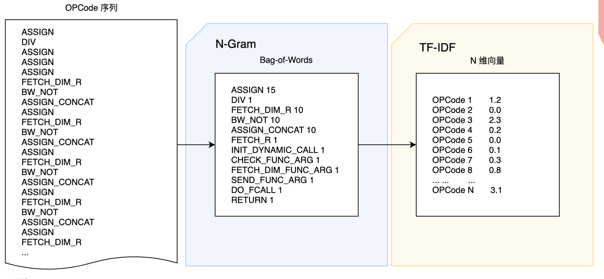

## 基于机器学习的  Webshell 检测

> Research of Webshell Detection Based on Machine Learning

本课题旨在研究机器学习在 Webshell 检测中的应用，以目前应用广泛的服务器端语言 PHP 为例，通过学习和研究 PHP Webshell 在检测中的对抗手段，收集充分的黑白样本用于机器学习模型训练，采用较为有效的方式进行特征化工程，清洗出可用于机器学习的带有标签的标准化特征向量，从而进行监督式机器学习。

同时尝试采用不同机器学习算法进行学习训练，如 Bagging 算法系列中较为著名的随机森林分类算法、Boosting 算法系列中较为著名的 XGBoost 提升算法、模式识别领域中较为常见的 K-近邻算法、分类问题中较为经典的有监督学习算法决策树分类算法等，对比训练结果遴选出最优算法模型。最后通过网格搜索和交叉验证对训练模型进行优化，用得到的训练模型来对新的 PHP 样本文件进行检测试验，观察其检测效果及对未知样本的检测能力，进行试验结果评估和总结。

## Overview

Webshell 检测策略：

PHP Webshell 免杀：

主要相关工作：

检测框架：

## Related Work

数据收集：

OPCode 提取：

自然语言处理：

机器学习模型训练：

## System Design & Development

Machine Learning

Web Application

前端 UI 界面：

扫描报告模板：

CLI Application

运行结果演示：

GUI Application

运行结果演示：

**- 参考 -**

- https://github.com/opensec-cn/chip
- https://github.com/0v3rW4tch/webshell_detect_cms
- https://github.com/hooog/webshellDc
